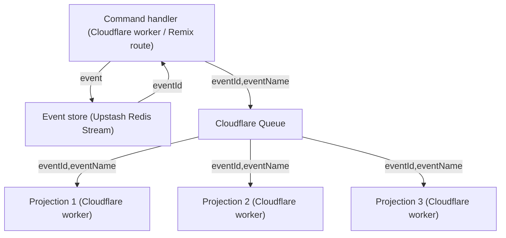

```mermaid
flowchart
    commandHandler["Command handler (Cloudflare worker / Remix route)"] --event --> upstashRedisStream["Event store (Upstash Redis Stream)"]
    upstashRedisStream --eventId-->commandHandler
    commandHandler --eventId,eventName-->cfQueue["Cloudflare Queue"]
    cfQueue --eventId,eventName-->cfWorker1["Projection 1 (Cloudflare worker)"]
    cfQueue --eventId,eventName-->cfWorker2["Projection 2 (Cloudflare worker)"]
    cfQueue --eventId,eventName-->cfWorker3["Projection 3 (Cloudflare worker)"]
```